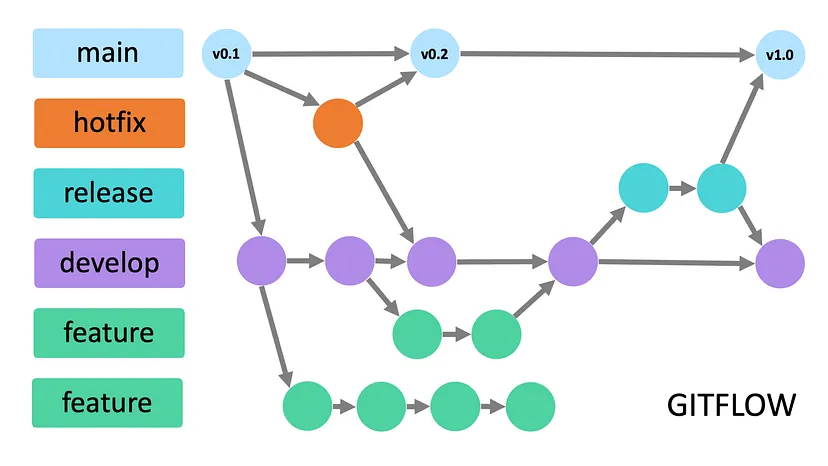
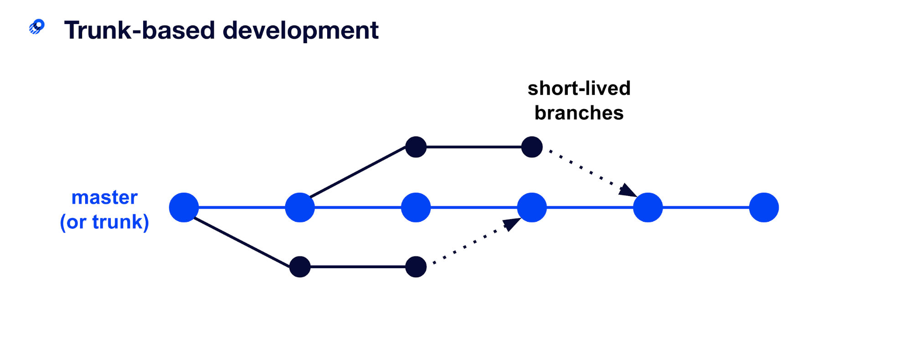
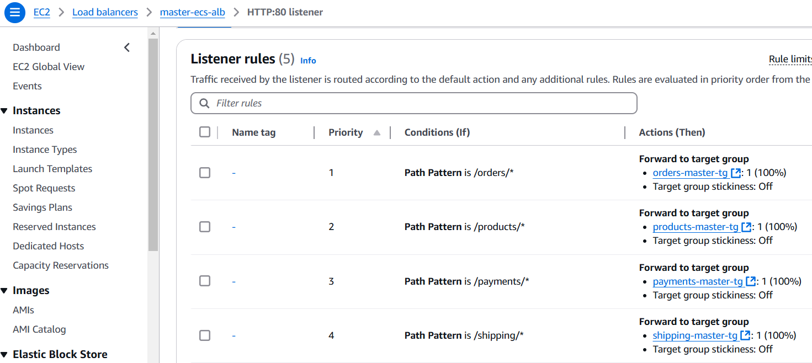

# ORT-FI-8184-DevOps 2024S2-G6-AMARTINEZ

Agustín Martinez - 274479

Tutor: Federico Barceló

## Índice

- [Presentación del problema](#presentación-del-problema)
- [Solución propuesta](#solución-propuesta)
  - [Herramientas utilizadas](#herramientas-utilizadas)
  - [Planificación](#planificación)
  - [Repositorio de código](#repositorio-de-código)
    - [Estrategia de ramas](#estrategia-de-ramas)
    - [Repositorio microservicios](#repositorio-microservicios)
    - [Repositorio frontend](#repositorio-frontend)
    - [Repositorio devops](#repositorio-devops)
  - [Workflow CI/CD](#workflow-cicd)
    - [CI/CD Frontend](#cicd-frontend)
    - [CI/CD Microservicios](#cicd-microservicios)
    - [Infraestructura como código](#infraestructura-como-código)
  - [Test automatizados](#test-automatizados)
  - [Análisis de código](#análisis-de-código)

---

## Presentación del problema
Describe aquí el problema que busca resolver tu proyecto. Incluye contexto, motivaciones y cualquier dato relevante.

---

## Solución propuesta
Explica la solución planteada para abordar el problema, incluyendo las principales características y beneficios.

### Herramientas utilizadas
Listado de herramientas y tecnologías utilizadas en el proyecto:

- **Herramienta de Versionado**: GitHub 
- **Herramienta de CI/CD**: GitHub Actions 
- **Aplicativo de FE a buildear y desplegar**: React 
- **Herramienta para análisis de código estático**: SonarCloud 
- **Herramienta para análisis de prueba extra**: JUnit & Mockito
- **Cloud provider**: AWS 
- **Orquestador**: AWS ECS 
- **Servicio serverless a usar**: API Gateway
- **Herramienta para el IaC**: Terraform

### Planificación

Se decidió utilizar un tablero Kanban en Jira para la planificación y seguimiento de las tareas. Con esto logré tener una visualización clara y sencilla del flujo de trabajo. Además, contaba con la flexibilidad necesaria para poder agregar, modificar y eliminar tareas a medida que iba avanzando con la implementación.

A continuación, se muestran algunas imágenes a modo de evidencia de lo que fue la evolución del tablero.

---

## Repositorio de código
Como se mencionó anteriormente, GitHub fue la herramienta elegida como repositorio de código. Esta decisión fue tomada basándome en mi experiencia con la herramienta, su amplía adopción en la industria y la practicidad de utilizar GitHub Actions, herramienta la cual fue enseñada en el curso.

En GitHub se definió una organización con el nombre "obligatorio-devops-agustin" la cual contiene todos los repositorios de los que se hablará a continuación. Además se crearon los secrets necesarios para los flujos de CI/CD dentro de la misma, estos secrets contienen tokens para acceder a AWS, DockerHub y SonarCloud.

**Secrets de la Organización**

### Estrategia de ramas
Tanto para los repositorios de microservicios como para el del frontend se decide utilizar la estrategia de ramas GitFlow. En estos repositorios se definen tres ramas principales las cuales son master, staging y dev. De esta forma tendremos la rama master por un lado, que apunta a ser una rama estable la cual está lista para producción en cualquier momento y la rama staging en donde ocurrirá la preparación de nuevas versiones. Además, existirán ramas específicas por cada característica a desarrollar (feature branch), esto aporta flexibilidad a los desarrolladores al momento de colaborar sin interferir entre sí.

**Evidencia Git Flow**

---

Para el repositorio de DevOps se utiliza la estrategia de trunk-based. Debido a que este repositorio contendrá configuraciones de infraestructura y scripts de automatización, los cambios serán pequeños, incrementales y requerirán una rápida validación en los entornos de integración y producción. Con la estrategia de trunk-based fomentamos la agilidad, con commits frecuentes e integración continua, evitando largas ramas que pueden llegar a retrasar la implementación de nuevos cambios.

**Evidencia Trunk-Based**

### Repositorio microservicios
El repositorio de microservicios es un mono-repo, esto quiere decir que contiene dentro del mismo, los 4 microservicios a desplegar. Además se incluye el archivo necesario para el flujo de CICD.

### Repositorio frontend
Este repositorio contiene la aplicación del frontend seleccionada. Como se mencionó anteriormente, esta es la de React, específicamente la aplicación de "catalog". Además, incluye el archivo necesario para el flujo de CICD.

### Repositorio devops
En este repositorio se pueden encontrar principalmente dos cosas. Por un lado, tenemos los archivos correspondientes a los flujos de CICD, tanto del repositorio de microservicios como el de frontend. Además de los archivos de terraform necesarios para desplegar toda la infraestructura como código. 

---

## Workflow CI/CD
Para los flujos de CI/CD decidí utilizar el siguiente enfoque:

Cada repositorio (microservicios y frontend) tiene un workflow el cual se ejecuta cada vez que se realiza un push a las ramas de master, staging o dev. Este workflow, se encarga de llamar a otro, el cual se encuentra en el repositorio de devops. Al llamarlo le pasa algunos parámetros necesarios para continuar con el flujo.

El workflow del repositorio frontend, pasa por parámetro los siguientes datos:
  - Repositorio
  - Branch
  - Commit Hash

El workflow del repositorio de microservicios, pasa por parámetro los siguientes datos:
  - Repositorio
  - Branch
  - Commit Hash
  - Lista de microservicios

### CI/CD Frontend

Como se mencionó anteriormente, el workflow implementado para el repositorio de la aplicación frontend se dispara cada vez que se realiza un push a las ramas de dev, staging o master. Al ocurrir esto, el flujo genera un trigger hacia el repositorio de devops, pasándole datos importantes como el repositorio y la rama sobre la que se hizo el push, así como también el hash del commit realizado. 

El workflow en el repositorio devops se encarga de realizar las siguientes tareas:

En primer lugar, está la tarea “Build and Analyze Frontend Application”, esta tarea realiza el checkout del código con los datos que le fueron proporcionados por el trigger, configura NodeJS para así poder realizar la instalación de dependencias de la aplicación frontend y luego construirla. Por último, se realiza un análisis sobre la calidad y seguridad del código utilizando la herramienta SonarCloud.

La segunda tarea es “Deploy Infrastructure as Code”, esta tarea se ejecuta únicamente si la tarea anterior finaliza correctamente. Se encarga de realizar un checkout de la rama master del repositorio de devops para así obtener los archivos de terraform necesarios, configura las credenciales para conectarse con AWS, las mismas las obtiene accediendo a los secrets configurados en la organización. Por último, se posiciona en el directorio donde se encuentra la configuración de terraform correspondiente al frontend y ejecuta los comandos de terraform init y terraform apply para aplicar el despliegue de la infraestructura necesaria.

La última tarea es la de “Deploy Frontend to S3” y al igual que la anterior, esta tarea se ejecuta únicamente si la anterior finaliza correctamente y sin ningún error. Nuevamente configura las credenciales de AWS basándose en los secrets de la organización y ejecuta el comando necesario para sincronizar la aplicación de frontend al bucket S3 desplegado en el paso anterior. Cabe aclarar que se utiliza un artifact de GitHub para acceder al build de la aplicación generado en la primera tarea.

**Evidencia del flujo implementado**

### CI/CD Microservicios

Como se mencionó anteriormente, el workflow implementado para el repositorio de los microservicios se dispara cada vez que se realiza un push a las ramas de dev, staging o master. Al ocurrir esto, el flujo genera un trigger hacia el repositorio de devops, pasándole datos importantes como el repositorio y la rama sobre la que se hizo el push, así como también el hash del commit realizado y una lista de los microservicios a desplegar. 

El workflow en el repositorio devops se encarga de realizar las siguientes tareas:

En primer lugar, está la tarea de “Build, Test, and Analyze Microservices”, esta tarea realiza el checkout del código con los datos que le fueron proporcionados por el trigger. Configura Java para poder ejecutar Maven y procede a realizar tanto la compilación como el análisis de los microservicios. Por cada microservicio recibido desde el trigger en la lista, ejecuta el comando "mvn -B clean test", esto compila y ejecuta las pruebas implementadas, luego realiza el análisis del código con SonarCloud.

La segunda tarea es “Publish Images DockerHub”, esta tarea se ejecuta únicamente si la tarea anterior finaliza correctamente. Lo primero que se hace es recuperar el artifact empaquetado en el paso anterior, se autentica en DockerHub utilizando los secrets correspondientes en la organización y comienza a construir las imágenes. Por cada microservicio en la lista, genera un tag basándose en la rama y el commit, construye la imagen y sube la misma al repositorio de DockerHub.

Por último, está la tarea de “Deploy Infrastructure as Code”, al igual que la tarea anterior, esta solo se ejecuta si el paso anterior finaliza exitosamente. Comienza realizando un checkout del repositorio de devops para obtener los archivos necesarios de terraform, y configura las credenciales de AWS, utilizando los secrets de la organización. Luego se posiciona en el directorio donde se encuentra la configuración de terraform correspondiente al backend y ejecuta los comandos de terraform init y terraform apply, esto despliega la infraestructura necesaria con las imágenes de los microservicios actualizadas.

**Evidencia del flujo implementado**

### Infraestructura como código

Para el manejo de la IaC se decidió utilizar terraform, debido a la robustez de la herramienta, su capacidad de integrarse con varios proveedores de nube y que fue la aprendida durante el curso. Esta tiene la capacidad de manejar distintos workspaces, en este caso decidí implementar un workspace por cada ambiente a desplegar, los mismos son dev, staging y master. Por otra parte, para el despliegue de los microservicios, decidí utilizar módulos. Debido a que el despliegue de los microservicios implica desplegar varios recursos, el separar la solución en varios módulos facilita el entendimiento de la solución, además de que ayuda en el mantenimiento y escalabilidad de esta.

La estructura de archivos generada para terraform es la siguiente.

Terraform implementa un manejo del estado, mediante el cual se puede conocer el estado de la infraestructura desplegada en todo momento y facilita el mantenimiento de la misma. Este mantenimiento del estado se puede hacer de manera local aunque esto no es lo ideal para trabajar en conjunto con varias personas. Es por esto que se decidió utilizar una opción mas robusta, mediante la cual el estado es almacenado en AWS, utilizando un S3 Bucket y una tabla en DynamoDB.

A continuación, se deja evidencia de algunos de los recursos desplegados en AWS.

**Cluster ECS**

**Application Load Balancer (ALB)**

**API GW**

Como se puede ver a continuación, tenemos tres S3 Buckets desplegados con el nombre frontend-application-{branch}, estos buckets son los que contienen la aplicación de frontend, compilada con el contenido del último commit realizado en las ramas de dev, staging y master respectivamente.

Además podemos ver el bucket terraform-state-agustin, en este último se almacena el estado de terraform mencionado anteriormente.

**S3 Buckets**

A continuación, se dejan diagramas realizados a grandes rasgos, sobre la infraestructura desplegada y como esta interactúa entre si. Por un lado, tenemos la solución para el backend, y por otro lado, para el frontend respectivamente.

**Aclaración**: El siguiente diagrama está simplificado para comprender la estructura y funcionamiento básico de la solución. No se incluyen en el mismo, algunos componentes fundamentales para el correcto funcionamiento de esta como lo son los target group, subredes, internet gateway y NAT gateway, aunque forman parte de la solución final.

**Microservicios**

**Frontend**

---

## Test automatizados

Los tests implementados en los microservicios son una buena herramienta que nos ayudan a garantizar la calidad y estabilidad del sistema. Combinando pruebas unitarias, de integración y de endpoints, logramos validar que cada componente cumpla su función y que las interacciones entre ellos se comporten según lo esperado.

Las pruebas unitarias, fueron diseñadas para verificar que los métodos internos funcionen correctamente, incluso cuando hablamos de casos bordes o datos inesperados. Por otra parte, las pruebas de integración aseguran que los componentes interactúen adecuadamente entre sí y que el sistema responda de forma consistente al interactuar con los otros microservicios.

Algo a destacar en las pruebas implementadas, es el uso de mocks. Utilizando la herramienta Mockito, tenemos la posibilidad de simular la respuesta de servicios externos. Esto permite recrear situaciones como pagos fallidos, falta de stock de productos o errores en los envíos, asegurando que el sistema maneje cada caso adecuadamente.

Por último, con las pruebas sobre los endpoints, podemos evaluar que los endpoint respondan correctamente, utilizando MockMvc por ejemplo, para simular solicitudes reales. Estas pruebas no solo validan los códigos de respuesta, sino también el contenido de las respuestas.

Combinando todo esto, los tests nos ayudan a identificar problemas no solo durante el desarrollo, sino que también durante el flujo CI/CD. La ejecución automática de los mismos, permite validar cada cambio en el código antes de ser desplegado, bloqueando el proceso en caso de encontrar cualquier problema. Esto nos ayuda a garantizar la estabilidad y funcionalidad de los servicios, incluso trabajando en un ambiente dinámico donde los despliegues son frecuentes.

Ejemplo de tests implementados para el microservicio de products:

A continuación, se muestra evidencia sobre la ejecución de los test implementados para los microservicios:

**Payments**

**Products**

**Shipping**

**Orders**

---

## Análisis de código
Detalla las herramientas de análisis estático o dinámico utilizadas:
- Ejemplo: SonarQube, ESLint.
- Reglas y configuraciones aplicadas.

---
